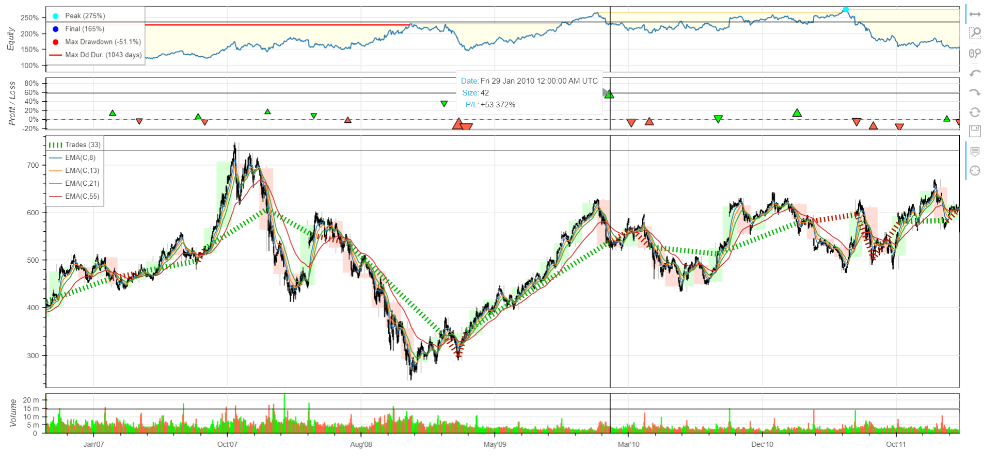

# BINANCE BOT

This python script uses the websocket api provided by binance and gets OLHC data for selected ticker (minute frequency).

* RSI Indicators is used to make buy sell decisions.
* RSI is calculated using TA-Lib.

## Get Started
```pip install -r requirements.txt```

 ```python src/bot.py```

# 

# STOCK DATA

A python script which uses NSE api to fetch Stock data from NSE, calulates required technical indicators and uses machine learning to make buy/sell predictions.

## Get Started
```python src/nse_train.py```

#
# Strategies

##  4EMA Strategy

 This technique uses 4 Exponential moving avaerage with 4 different timeframes 8, 13, 21, 55 respectively. The idea is to buy when the short EMAs crosses above the 55 EMA and the opposite of this is true for selling  side.

Implementation of 4EMA Strategy


When the short EMAs crosses the 55 EMA it's a buying signal indicated by the persian blue line labeled as positions.

## Get Started

``` python src/strategy.py```

## 4EMA Strategy Backtest

``` python src/backtest.py```

